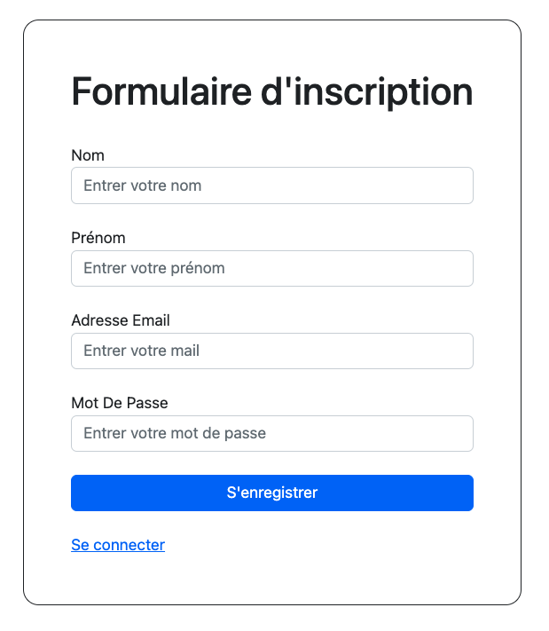
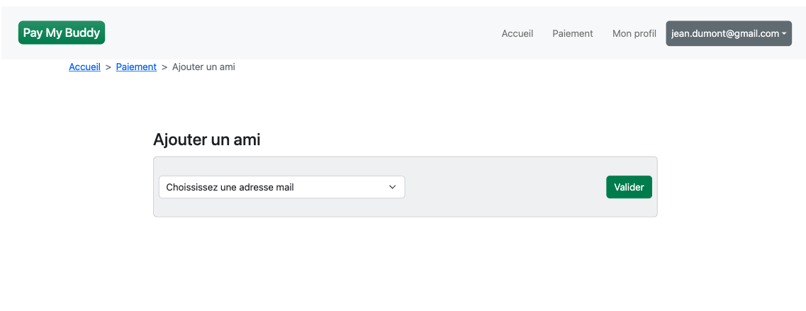

# PayMyBuddy

PayMyBuddy is an application for exchanging money between friends. You can credit your account from your bank account,
or at any time, transfer your money to your bank account

## Prerequisites

Before you begin, you need:

* Java 18.0.2.1
* Mysql 8.1.0
* IDE like Intellij / Eclipse

## Using PayMyBuddy

To use PayMyBuddy, follow these steps:

* Clone the project

### Database :

* After installing mysql, and setting your username and password, open a terminal and use the command :

```
mysql -u *username -p *password*
```

* Now create the PayMyBuddy database using the payMyBuddyCreateDb.sql file. Copy folder path and use command :

```
SOURCE /path_of_the_file
```

* A second file allows you to insert data into the database to be able to test it directly. To do this, use the
  payMyBuddyData.sql file, proceeding in the same way as before :

```
SOURCE /path_of_the_file
```

### Project setup :

* Open the project in your IDE. Open the application.properties file and edit the following lines:

```
spring.datasource.url=jdbc:mysql://localhost:3306/paymybuddy?serverTimezone=UTC 
(change the mysql port if it's not 3306)
spring.datasource.username="put your username here" 
spring.datasource.password="put your password here"
```

### Run the project and have fun

## Preview

* Login Page :


* Register Page



* Home page


* Payment Page


* Buddies Page



* Profile Page


